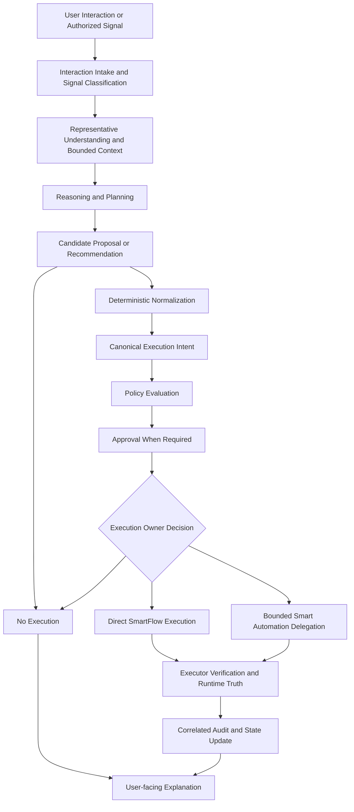

# SmartFlow Agent Orchestration

Status: Canonical Target Architecture
Last updated: 2026-07-30
Scope: target orchestration contract only

## 1. Purpose

This document defines SmartFlow's canonical target architecture for Agent
Orchestration.

Agent Orchestration is the bounded coordination layer that may sequence
reasoning, planning, proposal preparation, intent normalization, policy
evaluation, approval handling, execution-owner selection, execution observation,
and user-facing explanation.

It is not an autonomous-agent specification. It is not an implementation claim.
It does not grant new runtime authority.

## 2. Scope

This document covers the target orchestration model for:

- Interpreting user interactions and authorized project signals.
- Consuming Representative Engine outputs as context.
- Coordinating reasoning and planning without granting execution authority.
- Preparing candidate proposals and recommendations.
- Routing executable requests through deterministic normalization.
- Binding canonical Execution Intent to policy, approval, execution, audit, and
  explanation.
- Selecting exactly one execution owner when execution is allowed.
- Coordinating direct SmartFlow execution or bounded Smart Automation
  delegation.
- Observing runtime truth and producing user-facing explanations.

## 3. Non-goals

Agent Orchestration does not define:

- Autonomous background execution.
- A general-purpose agent loop.
- Runtime implementation details.
- A new policy engine.
- A new approval authority.
- A credential store.
- A user identity system.
- A Smart Automation implementation.
- Smart Automation authority expansion.
- New roadmap commitments.

Smart Automation, Execution Intent, Representative Engine, and the SmartFlow to
Smart Automation boundary remain governed by their own canonical documents.

## 4. Definition of Agent Orchestration

Agent Orchestration is a bounded coordination layer that orders and connects
existing architectural responsibilities. It may decide what step comes next in a
workflow, but it does not decide whether an unsafe or unauthorized action is
allowed.

The orchestrator may coordinate:

- Interaction intake.
- Context selection.
- Reasoning and planning.
- Candidate proposal preparation.
- Deterministic normalization.
- Canonical Execution Intent lifecycle.
- Policy evaluation.
- Approval request and approval-state handling.
- Execution-owner selection.
- Execution observation.
- Audit correlation.
- User-facing explanation.

The orchestrator must treat LLM output as advisory. Planning output has no
execution, approval, credential, identity, or policy authority.

## 5. Architectural Position and Dependencies

Agent Orchestration sits above the deterministic workspace engines, the
Representative Engine, the planning/proposal layer, the Execution Intent model,
policy, approval, execution runtimes, audit, and user-facing explanation.

It depends on:

- [current-architecture.md](current-architecture.md)
- [authority-model.md](authority-model.md)
- [execution-intent.md](execution-intent.md)
- [smartflow-smart-automation-boundary.md](smartflow-smart-automation-boundary.md)
- [target-architecture.md](target-architecture.md)
- [representative-engine.md](representative-engine.md)

The orchestrator cannot bypass any of those documents. When these documents
conflict with an orchestration proposal, the stricter authority, policy,
approval, execution, audit, or boundary rule wins.

## 6. Current Implementation Evidence and Limitations

Current SmartFlow evidence shows distributed workspace engines, an agent
pipeline, a planner, an approval model, a tool registry, execution policy,
bounded direct tools, GitHub write boundaries, and audit mechanisms.

Current SmartFlow does not implement a unified Agent Orchestration runtime. The
target model in this document does not claim that the following are implemented:

- Durable orchestration state.
- Cross-system Smart Automation delegation contracts.
- Cancellation contracts.
- Correlated audit across SmartFlow and Smart Automation.
- Autonomous workflows.
- A unified execution-owner coordinator.

Some audit state is currently in-memory rather than durable. Future
orchestration must not treat in-memory audit as sufficient for operations that
require durable recovery, replay prevention, compliance review, or cross-system
correlation.

No verified authority violation was found in the reviewed implementation
evidence. This is a scoped evidence statement, not an absolute claim about all
possible future code or unreviewed execution paths.

## 7. Target Orchestration Lifecycle

The target lifecycle is:

1. User interaction or authorized signal.
2. Representative understanding and bounded context.
3. Reasoning and planning.
4. Candidate proposal or recommendation.
5. Deterministic normalization.
6. Canonical Execution Intent, when execution is requested and allowed.
7. Policy evaluation.
8. Approval, when required.
9. One execution-owner decision.
10. Direct SmartFlow execution or bounded Smart Automation delegation.
11. Executor verification and runtime truth.
12. Correlated audit and state update.
13. User-facing explanation.

Many interactions end as explanations, recommendations, or plans. They must not
execute unless the interaction is normalized into a canonical Execution Intent,
passes policy, satisfies approval requirements, and has exactly one execution
owner.

## 8. Interaction Intake and Signal Classification

The orchestrator may receive authenticated user interactions and authorized
system signals. It must classify each input as one or more of:

- Question.
- Explanation request.
- Planning request.
- Recommendation request.
- Candidate execution request.
- Approval response.
- Cancellation request.
- Recovery or retry request.
- Unsupported or ambiguous request.

Unsupported, ambiguous, stale, or authority-unclear input must fail closed or
return a clarification path without execution.

## 9. Representative Engine Consumption Boundary

The Representative Engine may provide bounded context, prioritization,
recommendation material, provenance, and explanatory evidence. The orchestrator
may consume this output as context.

Representative Engine output does not grant executable authority. Registry
presence, surfaced capability availability, prioritization, or recommendation
material alone does not grant executable authority.

## 10. Reasoning and Planning Boundaries

Reasoning and planning may produce analysis, candidate steps, options,
explanations, or recommendations. These outputs are advisory.

The orchestrator must not treat reasoning or planning as:

- Approval.
- Policy evaluation.
- Credential authority.
- User identity.
- Runtime truth.
- Execution success.

The LLM has no execution, approval, credential, identity, or policy authority.

## 11. Candidate Proposal Lifecycle

A candidate proposal is non-executable until it is normalized into a canonical
Execution Intent and passes all required gates.

Candidate proposals must preserve:

- User-visible meaning.
- Source interaction or signal provenance.
- Material assumptions.
- Target scope.
- Risk-relevant fields.
- Required freshness evidence.

The orchestrator may present candidate proposals to the user, revise them, or
discard them. It must not execute them directly.

## 12. Deterministic Normalisation Boundary

Deterministic normalization converts candidate execution material into an exact
canonical Execution Intent or rejects it.

Normalization must be deterministic, schema-bounded, and fail-closed. It must
not broaden target scope, infer missing authority, replace approval, or repair
unsafe intent by silently changing its meaning.

## 13. Canonical Execution Intent Lifecycle

Canonical Execution Intent is the exact executable meaning that binds policy,
approval, execution, verification, audit, and explanation.

The orchestrator may create, pass, observe, expire, or cancel an intent. It must
not mutate the meaning of an approved intent after approval. Material changes,
freshness failures, missing target evidence, or stale state require renewed
validation and, when required, renewed approval.

## 14. Policy Evaluation Boundary

Policy evaluation is mandatory before execution. The orchestrator may request
policy evaluation and route the result, but it does not own policy authority.

Policy and approval are separate gates. Approval cannot bypass policy. Policy
success cannot bypass approval when approval is required. Unknown or unsupported
authority fails closed.

## 15. Approval Lifecycle and Exact-intent Binding

When approval is required, approval must bind to the exact canonical Execution
Intent being executed.

The orchestrator may present an approval prompt, record the user's response
through the approved approval mechanism, and route the approved exact intent to
the selected execution owner. The orchestrator does not approve on the user's
behalf.

Any material change to action, target, provider, content, risk, reversibility,
external effect, or freshness evidence invalidates prior approval.

## 16. Execution Ownership Decision

Every provider effect must have exactly one execution owner.

The orchestrator must choose one of:

- Direct SmartFlow execution.
- Bounded Smart Automation delegation.
- No execution.

SmartFlow and Smart Automation must not execute the same intent independently.
The orchestrator must not duplicate a semantic action across execution owners.

## 17. Direct SmartFlow Execution Coordination

Direct SmartFlow execution may occur only through implemented SmartFlow runtime
handlers, deterministic policy checks, required approval, target validation,
provider verification, and audit.

The orchestrator may coordinate the request and observe the result. It does not
own provider credentials and does not replace runtime handler validation.

## 18. Smart Automation Delegation Coordination

Smart Automation delegation is allowed only when a bounded delegation contract
exists and the canonical SmartFlow to Smart Automation boundary allows it.

Smart Automation cannot fabricate, broaden, or reinterpret SmartFlow authority.
SmartFlow cannot fabricate delegated success. Transport acknowledgement is not
provider success.

Delegation must preserve exact intent, user identity provenance, project
context, policy decision, approval binding, execution-owner identity, result
evidence, and audit correlation.

## 19. Verification, Result Handling, and User-facing Explanation

The executor is responsible for provider verification and runtime truth. The
orchestrator may collect execution results, correlate them with the intent, and
compose a user-facing explanation.

User-facing explanation must distinguish:

- Recommendation from execution.
- Approval requested from approval granted.
- Dispatch from provider success.
- Partial success from full success.
- Runtime truth from model-generated text.
- Failure from cancellation.

## 20. Audit and Runtime-truth Coordination

Audit follows runtime truth. Audit records do not authorize replay.

The orchestrator must correlate intake, proposal, normalization, policy,
approval, execution-owner selection, execution result, recovery, and user-facing
explanation where durable correlation is required.

For durable operations, audit must preserve enough information to explain what
was requested, what was approved, which owner executed, what provider result was
verified, and what was shown to the user.

## 21. Retry, Recovery, Cancellation, and Stale-state Handling

Retry must not create new semantic authority. A retry may repeat only the same
approved canonical Execution Intent when policy, approval, freshness,
idempotency, and runtime-owner rules still allow it.

Recovery must distinguish unknown outcome, known failure, known success, partial
success, cancellation, and stale state. Unknown outcomes must not be converted
into success by the orchestrator.

Cancellation must be honored when supported by the selected execution owner. If
cancellation is not supported or the outcome is already final, the orchestrator
must explain that state and avoid fabricating reversal.

## 22. Idempotency and Semantic-action Preservation

Idempotency protects a semantic action from accidental duplication. It does not
grant authority to execute a different action.

The orchestrator must preserve the semantic action across normalization,
approval, execution-owner selection, retry, recovery, audit, and explanation.
Changing the semantic action requires a new intent lifecycle.

## 23. Multi-project and Multi-user Isolation

Future orchestration must preserve project, workspace, user, tenant, provider,
and credential isolation.

Context from one project or user must not authorize actions for another. Audit,
approval, idempotency, delegation, and execution-owner state must retain
provenance across boundaries.

## 24. Human-in-the-loop Model

Humans remain the source of approval authority for approval-required actions.

The orchestrator may assist the human by presenting context, risks, target
details, candidate outcomes, policy failures, and next steps. It must not
pressure, hide material risk, pre-approve, or substitute model confidence for
human approval.

## 25. Failure and Fail-closed Model

The orchestrator must fail closed for:

- Unknown action.
- Unknown target.
- Unknown authority.
- Missing user identity.
- Missing project provenance.
- Unsupported provider.
- Unsupported execution owner.
- Missing policy decision.
- Policy denial.
- Required approval missing or stale.
- Freshness failure.
- Ambiguous runtime outcome.
- Delegation contract mismatch.
- Audit correlation failure where durable correlation is required.

Failure may produce an explanation, recommendation, or clarification request. It
must not produce unauthorized execution.

## 26. Observability and Operations

Future orchestration should expose operational visibility for:

- Intake classification.
- Proposal generation.
- Normalization result.
- Policy decision.
- Approval state.
- Execution-owner selection.
- Direct execution or delegation dispatch.
- Provider verification.
- Retry and recovery state.
- User-facing explanation state.

Observability must not leak provider credentials, secrets, private user data, or
cross-project context.

## 27. Persistence and Durable State Requirements

Durable orchestration is required when workflows may cross request boundaries,
wait for approval, delegate to another system, retry, recover, cancel, or need
compliance-grade audit.

Durable state must preserve the canonical intent, policy result, approval
binding, execution owner, idempotency key, provider result evidence, runtime
truth, audit correlation, and user-facing explanation state as needed for the
workflow.

In-memory state is acceptable only for bounded non-durable interactions where
loss cannot produce duplicate execution, stale approval, hidden success, hidden
failure, or audit ambiguity.

## 28. Current-to-target Mapping

| Concern | Current implementation | Target orchestration |
| --- | --- | --- |
| Workspace context | Distributed workspace engines | Bounded representative context consumed as orchestration input |
| Reasoning | AI reasoning proposal and deterministic validation | Advisory reasoning coordinated before normalization |
| Planning | Proposal-only planner | Planning remains non-authoritative and non-executable |
| Intent | Distributed intent facts and runtime inputs | Canonical Execution Intent coordinates policy, approval, execution, audit, and explanation |
| Policy | Execution policy checks direct runtime calls | Mandatory gate before direct execution or delegation |
| Approval | Approval model and selected write approval paths | Exact-intent approval binding across direct and delegated execution |
| Execution | Bounded direct read/write handlers | Exactly one owner: direct SmartFlow, delegated Smart Automation, or no execution |
| Audit | Mixed durable and in-memory audit mechanisms | Correlated durable audit where workflow risk requires it |
| Delegation | No unified Smart Automation delegation runtime | Bounded future delegation under the SmartFlow to Smart Automation boundary |

## 29. Target Invariants

- Many interactions end without execution.
- LLM output is advisory.
- Planning has no authority.
- The orchestrator does not approve.
- Approval binds exact canonical intent.
- Policy and approval are separate and mandatory where applicable.
- Material changes and freshness failures require renewed validation and
  approval when approval is required.
- Unknown or unsupported authority fails closed.
- Registry presence alone does not grant executable authority.
- The orchestrator never owns provider credentials.
- One provider effect has one execution owner.
- SmartFlow and Smart Automation must not execute the same intent
  independently.
- Smart Automation cannot fabricate, broaden, or reinterpret SmartFlow
  authority.
- SmartFlow cannot fabricate delegated success.
- Transport acknowledgement is not provider success.
- Audit records never authorize replay.
- Retry must not create new semantic authority.
- Future orchestration must preserve project, user, provider, and provenance
  isolation.

## 30. Mermaid Orchestration Flow Diagram

## 31. Relationship to Future Implementation Work

Future implementation work may introduce an orchestration runtime only if it
preserves this document's boundaries and the upstream canonical architecture
documents.

Implementation must not use this document as permission to add autonomous
execution, bypass approval, bypass policy, weaken execution ownership, collapse
SmartFlow and Smart Automation authority, or treat model output as runtime
truth.

Any significant implementation change that alters authority, execution,
delegation, persistence, audit, or cross-system ownership requires architecture
review and, where needed, an ADR before runtime work.
