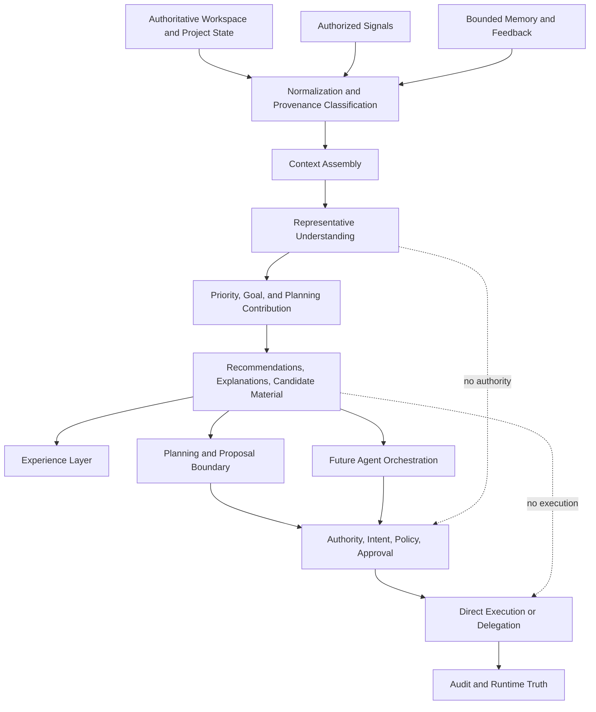

# SmartFlow Representative Engine

Status: Canonical Architecture
Last updated: 2026-07-30
Scope: representative-engine target contract only

## 1. Purpose

The Representative Engine defines how SmartFlow represents what matters now.

It is the bounded, explainable system that turns authenticated user interaction
and authorized workspace/project signals into representative workspace
understanding and advisory decision material for the Experience Layer.

SmartFlow needs this document because current workspace engines already
produce signals, memory insights, priorities, goals, plans, recommendations,
approval metadata, and workspace view models, but no single canonical document
defines the target contract for that representational work.

This document does not prove a unified Representative Engine runtime exists.
Current implementation remains the evidence recorded in
[Current Architecture](current-architecture.md).

## 2. Scope

This document governs:

- representative workspace understanding,
- provenance and freshness expectations,
- bounded context assembly,
- signal interpretation,
- memory usage limits,
- priority, goal, and planning contribution boundaries,
- recommendation and explanation material,
- current-to-target mapping,
- target invariants.

It applies to future systems that produce representative understanding for
SmartFlow's user-facing workspace and project experience.

## 3. Non-Goals

The Representative Engine is not:

- an autonomous executor,
- an approval authority,
- an execution policy engine,
- a credential owner,
- an external provider runtime,
- a tool runtime,
- a future Agent Orchestration system,
- a semantic memory implementation,
- a vector database design,
- a UI specification,
- a roadmap,
- an API design.

It MUST NOT create execution authority, approve actions, bypass policy, mutate
providers, own secrets, or convert recommendations into execution intent.

## 4. Definition of the Representative Engine

The Representative Engine is SmartFlow's target architecture boundary for
representing user, workspace, and project context.

It MAY:

- classify authorized signals,
- assemble bounded context,
- identify what appears important now,
- rank and explain priorities,
- produce advisory goals,
- produce planning inputs,
- prepare candidate material for later proposal boundaries,
- expose uncertainty and missing context.

It MUST NOT:

- execute tools,
- approve actions,
- own policy,
- own execution intent,
- own provider credentials,
- treat LLM output as authoritative fact,
- treat memory as source truth,
- treat UI state as runtime truth.

## 5. Architectural Position Within SmartFlow

The Representative Engine sits between project/workspace state, context and
memory, reasoning, and the Experience Layer.

It consumes bounded state and context. It produces representative understanding
and advisory decision material. It does not own execution.

In the target architecture, it is upstream of:

- Experience Layer presentation,
- Planning and Proposal material,
- later Agent Orchestration inputs.

It is outside the authority of:

- approval,
- execution intent,
- execution policy,
- tool runtime,
- direct execution,
- automation delegation,
- audit runtime truth.

## 6. Relationship to the Experience Layer

The Experience Layer MAY display Representative Engine output as workspace
cards, priorities, recommendations, explanations, candidate material, and
status context.

The Experience Layer MUST keep representative material distinguishable from:

- source-system truth,
- approved execution intent,
- policy allow/deny results,
- runtime success,
- audit records.

The Experience Layer MUST NOT turn presentation state into authority. A visible
recommendation, selected card, highlighted goal, or clicked UI element is not
approval, policy, or execution.

## 7. Relationship to Workspace and Project State

Workspace and Project State provide the authoritative and derived facts the
Representative Engine may use.

The Representative Engine MAY consume:

- project metadata,
- repository state,
- task state,
- calendar state,
- learning state,
- finance and habit signals where authorized,
- integration status,
- recent execution outcomes,
- current goals and active work.

It MUST classify state as source-system truth, SmartFlow-derived state, cached
state, inferred state, or user-declared state. Derived, cached, inferred, or
user-declared state MUST NOT override authoritative source truth without
validation.

## 8. Relationship to Context and Memory

Context and Memory provide bounded history and continuity.

The Representative Engine MAY use:

- session context,
- project context,
- bounded workspace memory,
- interaction feedback,
- reflection evidence,
- execution history,
- preferences,
- derived summaries,
- external-source references.

Memory is not authority. Memory is not approval. Memory MUST NOT override
current provider, project, or runtime truth. Stale memory must remain
identifiable.

## 9. Relationship to Reasoning

Reasoning may assist the Representative Engine by interpreting requests,
identifying uncertainty, comparing options, explaining context, and proposing
candidate material.

LLM output is advisory until deterministic systems validate it. The
Representative Engine MUST preserve the distinction between:

- deterministic facts,
- source facts,
- LLM-generated interpretation,
- inferred state,
- missing or uncertain state.

Reasoning MUST NOT grant authority, approve execution, own credentials, bypass
policy, fabricate audit outcomes, or mutate canonical intent.

## 10. Relationship to Planning and Proposal

The Representative Engine may provide advisory material to Planning and
Proposal.

It MAY produce:

- priority inputs,
- goal candidates,
- planning context,
- suggested next steps,
- risks,
- reasons,
- uncertainty,
- stopping conditions.

A recommendation is not execution intent. A candidate proposal is not approval.
A plan does not grant authority. Planning and Proposal must create or request
canonical intent through the Execution Intent boundary before any execution
path can proceed.

## 11. Relationship to Authority, Approval, Execution Intent, Policy, Tools, and Execution

The Representative Engine is constrained by:

- [Authority Model](authority-model.md),
- [Execution Intent](execution-intent.md),
- [SmartFlow to Smart Automation Boundary](smartflow-smart-automation-boundary.md),
- [Target Architecture](target-architecture.md).

It MUST NOT own:

- authentication,
- user approval,
- execution intent,
- policy allow/deny decisions,
- tool handler registration,
- provider execution,
- direct execution,
- Smart Automation delegation,
- audit runtime truth.

Deterministic policy, canonical intent, approval, direct execution,
delegation, and audit remain outside the Representative Engine's authority.

## 12. Current Implementation Evidence and Limitations

Current repository evidence shows a distributed workspace representation
pipeline, not a unified Representative Engine runtime.

Implemented or partially implemented evidence:

- `useWorkspace()` composes the current workspace pipeline.
- `signalEngine` produces deterministic domain signals.
- `memoryEngine` maintains bounded local workspace memory.
- `interactionFeedbackEngine` derives weak interaction signals.
- `decisionIntelligenceEngine` derives advisory decision profile data.
- `personalizationEngine` computes bounded domain affinity.
- `priorityEngine` ranks signals while keeping high-severity current signals
  dominant.
- `goalEngine` produces proposed goals with constraints.
- `plannerEngine` produces proposed plans and explicitly does not mutate
  workspace data.
- `toolResolver` maps supported read-only plan steps and rejects unsupported
  mutation mappings.
- `approvalEngine` classifies proposed steps but does not approve or execute.
- `workspaceEngine` composes the user-facing workspace model.
- execution policy, tool registry, execution runtime, and audit exist outside
  the workspace representation pipeline.

Current limitations:

- no unified Representative Engine runtime type exists,
- workspace memory is local and bounded,
- some audit state is in-memory,
- project identity and multi-project isolation are not fully implemented,
- memory provenance is limited,
- Tool Resolver V1 resolves only explicit read-only mappings,
- planner output remains proposal-only,
- static right-rail recommendation content exists in the current workspace
  composer,
- no Smart Automation delegation exists in SmartFlow.

## 13. Target Inputs

Target Representative Engine inputs MAY include:

- authenticated user identity,
- explicit project identity,
- authorized workspace/project state,
- source-system state snapshots,
- integration status,
- capability availability,
- bounded memory,
- interaction feedback,
- reflection evidence,
- execution history,
- recent audit summaries,
- user-declared corrections,
- current time and freshness metadata.

Inputs MUST be scoped to the authenticated user and project. Inputs that lack
required identity, freshness, or provenance MUST be treated as incomplete or
non-authoritative.

## 14. Target Outputs

Target outputs MAY include:

- representative workspace understanding,
- prioritized domains or project areas,
- confidence and uncertainty,
- advisory goals,
- planning context,
- suggested next steps,
- recommendation reasons,
- missing-context prompts,
- candidate material for later proposal boundaries,
- provenance and freshness annotations,
- explanation material for the Experience Layer.

Outputs MUST NOT include provider credentials, hidden authority grants,
unbounded raw context, fabricated execution status, or unvalidated runtime
truth.

## 15. Authoritative Versus Derived Versus Inferred Versus Cached State

The Representative Engine MUST preserve state categories:

- Authoritative state: current state from the owning source or verified runtime
  owner.
- Derived state: deterministic SmartFlow computation from known inputs.
- Inferred state: advisory interpretation that may be uncertain.
- Cached state: stored copy of prior source or derived state with freshness
  metadata.
- User-declared state: user-provided context that may require validation.

Derived, inferred, cached, and user-declared state MUST NOT silently become
authoritative. When material to a recommendation or candidate action, the
output SHOULD show state category, provenance, and freshness.

## 16. Provenance and Freshness Model

Representative outputs SHOULD preserve:

- source system,
- collection time,
- derivation time,
- transformation owner,
- confidence,
- source identifiers where safe,
- cache age,
- expiry or stale-state indicator,
- relevant validation status.

Freshness rules:

- stale material state MUST NOT silently drive high-confidence
  recommendations,
- missing freshness MUST lower confidence or require clarification,
- current source truth wins over stale memory,
- stale execution-related state MUST require revalidation before proposal,
  approval, or execution.

## 17. Project and User Isolation Model

The Representative Engine MUST bind inputs and outputs to authenticated user
identity and explicit project identity where project context is involved.

Rules:

- cross-user context leakage is forbidden,
- cross-project context leakage is forbidden,
- memory retrieval must respect user and project scope,
- recommendations must identify the project context they represent,
- approvals and future execution candidates must bind to the same user and
  project target,
- repository, workspace, provider, and project identities must not be
  conflated.

If user or project identity is missing, ambiguous, or conflicting, the engine
MUST fail closed for material recommendations and MUST NOT prepare executable
candidate material.

## 18. Signal Interpretation Model

Signals are representational evidence, not authority.

The Representative Engine MAY interpret signals by:

- domain,
- severity,
- score,
- source,
- recency,
- confidence,
- supporting evidence,
- conflict with other signals.

High-severity current signals SHOULD dominate weak personalization or memory
signals. Weak signals MAY influence ordering only when they do not override
urgent current evidence.

Conflicting, missing, or low-confidence signals SHOULD produce uncertainty or
clarification, not fabricated certainty.

## 19. Memory Usage and Limits

Memory MAY provide continuity, preference hints, repeated patterns, and
reflection evidence.

Memory MUST remain bounded by:

- user scope,
- project scope where applicable,
- retention limits,
- sensitivity constraints,
- freshness,
- provenance,
- relevance to the current request or workspace state.

Memory MUST NOT:

- approve actions,
- authorize tools,
- override source truth,
- create execution intent,
- claim provider success,
- expose unbounded private context,
- substitute summaries for current source data where execution risk depends on
  correctness.

## 20. Context Assembly Boundary

Context assembly prepares bounded context for reasoning, planning, and
experience.

It SHOULD include only relevant context with clear scope, provenance, and
freshness. It SHOULD exclude secrets, raw provider tokens, unrelated user data,
unbounded conversation history, raw private payloads, and internal prompts not
needed for the current representational task.

Context assembly MUST NOT become a hidden data exfiltration path or a hidden
execution path.

## 21. Priority, Goal, and Planning Contribution Boundaries

The Representative Engine MAY contribute:

- priority ordering,
- goal candidates,
- planning constraints,
- supporting reasons,
- risk hints,
- missing-context markers.

It MUST NOT:

- execute a plan,
- make a plan authoritative,
- approve a plan,
- skip canonical intent,
- skip policy evaluation,
- convert a goal into execution authority.

Current `goalEngine` and `plannerEngine` evidence already reflects this
boundary: goals and plans are proposed and include no autonomous execution.

## 22. Recommendation and Explanation Model

Recommendations should be explainable.

Recommendation output SHOULD include:

- what is recommended,
- why it is recommended,
- source signals,
- confidence,
- uncertainty,
- relevant freshness,
- material provenance,
- whether it is advisory only,
- what user decision or validation is needed next.

Explanations MUST NOT embellish runtime truth, hide uncertainty, claim
execution, or present a candidate as approved.

## 23. Determinism and Reproducibility Expectations

Representative processing SHOULD be deterministic where safety, state
classification, prioritization, policy-adjacent behavior, or auditability
depends on reproducibility.

LLM-assisted reasoning MAY contribute advisory interpretation, but
deterministic systems must preserve:

- input boundaries,
- state classification,
- supported output shape,
- uncertainty handling,
- provenance,
- freshness,
- proposal-only status.

Given the same source inputs, deterministic components SHOULD produce the same
representative output or record why time, freshness, or source changes altered
the result.

## 24. Human Correction and Feedback Model

Users MAY correct representative understanding.

Human correction and feedback MAY affect:

- displayed context,
- future memory,
- prioritization hints,
- goal selection,
- planning material,
- uncertainty resolution.

Human correction MUST NOT bypass policy, create approval, or cause execution by
itself. Corrections that affect source truth or execution targets MUST be
validated against the owning source before they are used for execution intent.

## 25. Failure and Fail-Closed Behavior

The Representative Engine MUST fail closed for material state when:

- user identity is missing,
- project identity is ambiguous,
- source truth is unavailable,
- state provenance is missing,
- freshness is unknown and material,
- inputs conflict,
- memory contradicts current source truth,
- reasoning output is unsupported,
- output would imply execution authority.

Failing closed may mean lowering confidence, showing uncertainty, requesting
clarification, suppressing a recommendation, or refusing to prepare candidate
material. It must not silently invent authoritative state.

## 26. Privacy and Data-Minimization Considerations

The Representative Engine SHOULD use the minimum data needed to represent the
current workspace or project question.

It MUST NOT include secrets, provider tokens, raw authorization headers,
unbounded conversation history, unrelated project data, unrelated user data, or
raw private provider payloads in representative outputs or reasoning context.

Sensitive inputs SHOULD be summarized, scoped, redacted, or omitted where the
full value is not required.

## 27. Persistence and Retention Boundaries

Persistence MAY store representative state, memory, derived summaries,
interaction feedback, and execution references only within defined ownership
and retention boundaries.

Persisted representative data SHOULD record:

- owner user,
- project scope,
- source or derivation,
- freshness,
- confidence,
- retention class,
- safe references to source data.

Representative persistence MUST NOT store provider credentials, raw secrets,
unbounded provider payloads, or hidden execution authority.

Not every representative output must be durable. Ephemeral workspace state may
remain transient when durability is not required.

## 28. Observability and Diagnostic Requirements

The target Representative Engine SHOULD make its behavior diagnosable.

Diagnostics SHOULD show:

- source inputs used,
- inputs excluded by scope,
- provenance category,
- freshness,
- confidence,
- reason for priority ordering,
- reason for suppressed recommendations,
- conflicts or missing context,
- whether reasoning was deterministic or LLM-assisted,
- output version where semantics change.

Diagnostics MUST NOT expose secrets or create alternate authority paths.

## 29. Current-to-Target Mapping

| Area | Current state | Target state | Status |
| --- | --- | --- | --- |
| Unified Representative Engine runtime | No unified runtime; distributed engines compose workspace representation | Explicit bounded representative-engine contract and possible runtime artifact | future architecture |
| Signal interpretation | `signalEngine` produces deterministic domain signals | Provenance-aware signal interpretation with freshness and conflict state | partially implemented |
| Workspace memory | Local bounded workspace memory | User/project-scoped provenance-aware memory | foundation present |
| Interaction feedback | Weak engagement and avoidance signals | Bounded feedback with diagnostic provenance | partially implemented |
| Personalization | Domain affinity hints | Explicit advisory personalization that cannot override source truth | partially implemented |
| Priority | High-severity signals dominate weak hints | Explainable priority model with provenance/freshness | partially implemented |
| Goal contribution | Proposed daily goals with constraints | Project-aware advisory goals with source bindings | partially implemented |
| Planning contribution | Planner V1 proposes bounded steps only | Advisory planning material for later proposal/orchestration boundaries | partially implemented |
| Context assembly | Workspace and agent context are assembled from bounded data | Explicit context boundary with provenance and freshness | foundation present |
| Reasoning | LLM proposals validated by deterministic systems | Advisory reasoning integrated without authority | partially implemented |
| Approval/execution separation | Approval, policy, runtime exist outside workspace engines | Representative Engine remains outside authority and execution | implemented boundary |
| Project isolation | Product direction defines Software Project focus | Explicit multi-project isolation model | future architecture |
| Persistence | Some local memory and persisted backend facts exist | Defined retention and durability boundaries for representative state | foundation present |
| Observability | Tests and limited diagnostic facts exist | Representative diagnostics for source, confidence, freshness, and suppression | planned |

## 30. Target Invariants

- Human authority remains ultimate.
- Representative output is advisory unless another canonical boundary grants
  authority.
- A recommendation is not execution intent.
- A candidate proposal is not approval.
- A plan is not authority.
- LLM output remains distinguishable from deterministic and source facts.
- Memory never overrides authoritative source truth.
- Cached, inferred, and stale data remain identifiable.
- Cross-user context leakage is forbidden.
- Cross-project context leakage is forbidden.
- Outputs preserve provenance and freshness when material.
- UI presentation is not runtime truth.
- The Representative Engine does not own provider credentials.
- The Representative Engine does not directly execute provider effects.
- Unknown, missing, conflicting, or stale material state does not silently
  become authoritative.
- Deterministic policy remains outside Representative Engine authority.
- Canonical intent remains outside Representative Engine authority.
- Approval remains outside Representative Engine authority.
- Direct execution and delegation remain outside Representative Engine
  authority.
- Audit runtime truth remains outside Representative Engine authority.
- Future Agent Orchestration cannot use representative output to bypass
  authority, intent, policy, approval, execution ownership, or audit.

## 31. Representative Engine Diagram

This flow does not itself cause execution.

## 32. Relationship to the Later Agent Orchestration Document

Future Agent Orchestration may consume Representative Engine outputs as
advisory context, priority material, recommendation material, or candidate
inputs.

Agent Orchestration MUST NOT treat Representative Engine output as:

- authority,
- approval,
- policy allow,
- execution intent,
- runtime truth,
- credential access,
- audit proof.

Agent Orchestration must preserve one canonical intent, one execution owner,
human authority, bounded delegation, auditable runtime truth, and no hidden
authority transfer.

## Architecture Gaps

Verified gaps and future requirements:

- No unified Representative Engine runtime exists.
- Current representative behavior is distributed across workspace engines.
- Workspace memory is local and bounded rather than a full durable,
  provenance-aware memory architecture.
- Project identity and multi-project isolation are not fully implemented.
- Memory provenance and freshness are partial.
- Some representative UI material is static in the current workspace composer.
- Representative diagnostics are limited.
- No Smart Automation delegation exists in SmartFlow.
- Future Agent Orchestration is not implemented.

These are constraints for future implementation, not proof that current
features are broken.

## Explicitly Out of Scope

This document does not design or implement:

- runtime code,
- tests,
- migrations,
- provider integrations,
- tool handlers,
- execution intent schema,
- policy language,
- semantic memory,
- embeddings,
- vector storage,
- UI redesign,
- service APIs,
- Agent Orchestration internals.

## Related Documents

- [Current Architecture](current-architecture.md)
- [Authority Model](authority-model.md)
- [Execution Intent](execution-intent.md)
- [SmartFlow to Smart Automation Boundary](smartflow-smart-automation-boundary.md)
- [Target Architecture](target-architecture.md)
