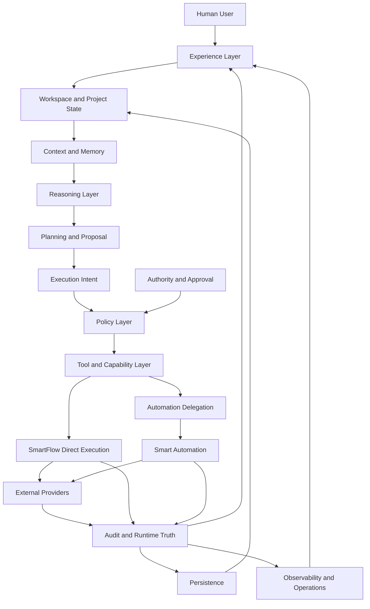
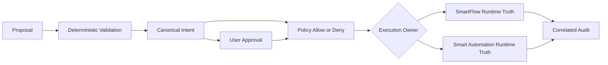

# SmartFlow Target Architecture

Status: Canonical Architecture
Last updated: 2026-07-30
Scope: target architecture specification only

## 1. Purpose

This document defines the intended end-state architecture SmartFlow is evolving
toward. It constrains future development without claiming that future
capabilities are implemented.

Document responsibilities:

- [Current Architecture](current-architecture.md) records verified implemented
  reality.
- Target Architecture defines the intended architectural destination.
- Roadmaps sequence work.
- ADRs record accepted architecture decisions.
- Representative Engine will define a future reasoning and representation
  subsystem.
- Agent Orchestration will define a future coordination model.

Target Architecture is not implementation proof. A capability is implemented
only when verified by current architecture evidence and runtime code.

## 2. Architectural Goals

The target architecture MUST:

- preserve human authority,
- separate reasoning from execution,
- fail closed,
- make execution intent explicit,
- support bounded action,
- preserve runtime truth,
- ensure auditability,
- support gradual capability growth,
- avoid duplicated responsibility,
- support direct and delegated execution,
- minimize credential exposure,
- provide deterministic state boundaries,
- support durable project context,
- remain testable,
- remain explainable,
- support safe future orchestration.

## 3. Non-Goals

This document does not authorize:

- fully autonomous operation,
- unrestricted tool use,
- self-granted authority,
- opaque multi-agent swarms,
- hidden provider execution,
- shared credential pools,
- LLM-owned policy,
- LLM-owned approval,
- unbounded memory access,
- replacing deterministic systems with prompts,
- merging SmartFlow and Smart Automation into one ambiguous runtime,
- concrete future APIs,
- implementation sequencing.

## 4. Target System Definition

SmartFlow is a layered personal and project operating system with AI-assisted
reasoning and bounded action.

In target architecture, SmartFlow:

- observes user-authorized data,
- maintains structured project and workspace state,
- reasons over bounded context,
- produces recommendations and plans,
- forms canonical execution intent,
- requests approval where needed,
- executes or delegates bounded actions,
- records runtime truth,
- explains outcomes to the user.

"Operating system" is a product architecture term. It does not mean SmartFlow
is an operating-system kernel or unrestricted runtime.

## 5. Architectural Layers

| Layer | Responsibility | Authoritative data | Inputs | Outputs | MUST NOT own |
| --- | --- | --- | --- | --- | --- |
| Experience Layer | Present workspace, proposals, approvals, status, audit, and explanations | Display state and user interaction events | Project state, results, audit summaries | UI state, user decisions | Runtime truth, credentials, policy authority |
| Workspace and Project State Layer | Compose current project/workspace model | SmartFlow-derived project/workspace state | Source data, integration state, execution outcomes | Structured workspace/project view | Provider source truth without verification |
| Context and Memory Layer | Retrieve bounded context and durable memory | Memory records with provenance and freshness | Project state, sessions, interactions, execution history | Bounded context packages | Approval, authority, source truth |
| Reasoning Layer | Interpret, compare, explain, and propose | None; output is advisory | Bounded context, user request | Candidate proposals, uncertainty | Policy, approval, execution |
| Planning and Proposal Layer | Build advisory plans and candidate actions | Proposed plan state | Goals, context, reasoning output | Plans, proposed steps | Execution authority |
| Authority and Approval Layer | Bind decisions to authenticated users | Approval records and decision state | Intent, policy facts, user action | Approval/rejection/expiry state | Execution success |
| Execution Intent Layer | Define exact executable meaning | Canonical intent facts | Validated proposal, target, risk, policy facts | Bounded intent identity | Concrete provider result |
| Policy Layer | Decide whether exact execution is allowed | Policy decisions and versions | Intent, tool, target, approval, runtime facts | Allow/deny decision | User consent or provider mutation |
| Tool and Capability Layer | Govern registered tools/capabilities | Capability metadata and handler availability | Tool definitions, constraints | Resolvable tool contracts | Runtime authority by metadata alone |
| Execution Layer | Execute direct SmartFlow operations | Terminal runtime state for direct execution | Approved intent, policy allow, handler | Provider operation, verification, result | LLM-driven provider calls |
| Automation Delegation Layer | Delegate appropriate execution to Smart Automation | Delegation correlation and status | Approved intent, policy, identity | Delegated execution status/result | Smart Automation credentials or runtime facts |
| Audit and Runtime Truth Layer | Record actual events and terminal truth | Audit records and runtime state | Policy, approval, execution, provider result | Correlated audit history | Approval or replay authority |
| Persistence Layer | Persist owned state safely | SmartFlow-owned persisted data | Runtime/domain events | Durable records, caches, references | All provider source truth or all secrets |
| Integration Boundary | Represent external systems safely | Integration metadata owned by each executor | Provider state, credentials, capability status | Normalized provider facts | Provider authority as SmartFlow authority |
| Observability and Operations Layer | Surface health, failures, latency, and correlation | Operational events and health state | Runtime/audit/system telemetry | Operational visibility | Alternate execution path |

## 6. Canonical Target Flow

Conceptual target flow:

```text
User interaction or authorized signal
-> workspace and project state retrieval
-> context assembly
-> reasoning
-> planning or recommendation
-> candidate proposal
-> deterministic normalization
-> canonical Execution Intent
-> policy evaluation
-> approval when required
-> execution ownership decision
-> direct SmartFlow execution or bounded Smart Automation delegation
-> provider operation
-> verification
-> audit and runtime state update
-> user-facing explanation
```

Not every interaction results in execution. Reads and writes may have different
approval requirements. Planning does not imply authority. Delegation does not
transfer unlimited authority. Audit reflects actual runtime truth.

## 7. Experience Layer

The Experience Layer owns the user-facing operating surface.

Responsibilities:

- project navigation,
- contextual presentation,
- recommendations,
- action previews,
- approval interfaces,
- execution status,
- result explanation,
- audit visibility,
- recovery guidance,
- notification presentation.

It MUST NOT fabricate runtime success, determine authority from UI state alone,
mutate approved intent silently, expose credentials, or treat LLM prose as
executable truth.

## 8. Workspace and Project State Layer

Target project state includes:

- project metadata,
- repository state,
- roadmap state,
- task state,
- learning state,
- current goals,
- active work,
- capability availability,
- integration status,
- recent execution outcomes.

State categories:

- Source-system truth originates from the owning system or provider.
- SmartFlow-derived state is computed from validated inputs.
- Cached state is a time-bounded copy.
- Inferred state is advisory and must show uncertainty.
- User-declared state is user input until validated against source truth where
  needed for execution.

Derived or cached state MUST NOT override authoritative source truth without
validation.

## 9. Context and Memory Layer

Target memory is bounded, provenance-aware context for reasoning and
presentation.

Memory categories MAY include:

- session context,
- project context,
- durable user-approved memory,
- interaction history,
- execution history,
- preferences,
- derived summaries,
- external-source references.

Constraints:

- memory access is bounded,
- memory is not authority,
- memory is not approval,
- stale memory must be identifiable,
- provenance should be retained,
- sensitive data should be minimized,
- execution decisions require current validation,
- summaries must not replace authoritative source data.

This document does not design semantic memory, embeddings, or vector storage.

## 10. Reasoning Layer

AI reasoning MAY:

- interpret requests,
- identify relevant context,
- compare options,
- generate explanations,
- recommend actions,
- propose plans,
- identify uncertainty,
- request missing information,
- produce candidate proposals.

AI reasoning MUST NOT grant authority, approve execution, own credentials,
bypass policy, treat assumptions as runtime facts, execute providers directly,
mutate canonical intent after approval, or fabricate audit outcomes.

Reasoning outputs remain proposals until deterministic systems validate them.

## 11. Planning and Proposal Layer

Plans may contain:

- goals,
- ordered steps,
- dependencies,
- expected outcomes,
- risks,
- proposed tools,
- required approvals,
- stopping conditions.

A plan MUST NOT itself be executable authority.

Distinctions:

- Advisory plan: suggested structure for work.
- Candidate action: possible action before deterministic validation.
- Validated action: normalized supported action candidate.
- Canonical intent: exact executable meaning.
- Orchestration plan: future multi-step coordination model, not designed here.

## 12. Authority and Approval Layer

Authority and approval derive from [Authority Model](authority-model.md).

Target responsibilities:

- authenticate the user,
- bind decisions to the correct principal,
- determine approval requirements,
- present exact action meaning,
- record approval or rejection,
- support expiry, revocation, and invalidation,
- prevent fabricated approval,
- enforce least privilege.

Approval MUST remain distinct from authentication, provider connection, policy
allow, execution success, and audit record.

## 13. Execution Intent Layer

Execution Intent derives from [Execution Intent](execution-intent.md).

Target responsibilities:

- construct canonical bounded intent,
- normalize relevant facts,
- bind user, tool, target, arguments, risk, and freshness,
- bind approval,
- support idempotency and replay protection,
- prevent post-approval semantic mutation,
- support direct or delegated execution without changing meaning.

Target architecture MAY later introduce a unified runtime type for execution
intent. This document does not design the concrete schema.

## 14. Policy Layer

Target policy hierarchy MAY include:

- system policy,
- user policy,
- project policy,
- capability policy,
- provider or integration policy,
- risk policy,
- protected-resource policy,
- runtime safety policy.

Rules:

- all required policies must allow,
- any authoritative deny blocks execution,
- unknown policy state fails closed,
- policy facts must be server-validated,
- LLM or client declarations are non-authoritative,
- policy decisions must be auditable,
- policy must be separate from approval.

This document does not design a policy language.

## 15. Tool and Capability Layer

A target capability should conceptually include:

- stable identifier,
- bounded purpose,
- risk classification,
- input validation,
- handler availability,
- policy requirements,
- approval requirements,
- target restrictions,
- result type,
- audit requirements,
- execution owner.

Rules:

- registry presence alone does not grant execution,
- unsupported tools fail closed,
- handlers must be explicit,
- capability metadata must not substitute for runtime validation,
- tool descriptions for LLM use are not authority.

## 16. Execution Layer

SmartFlow SHOULD directly own execution when the operation is:

- bounded,
- short-lived,
- supported by a deterministic handler,
- project-centric,
- immediately verifiable,
- operationally simple,
- appropriately auditable.

The execution layer must own:

- handler resolution,
- server credentials,
- pre-execution revalidation,
- provider request construction,
- idempotency or claim semantics,
- provider response classification,
- verification,
- terminal runtime state,
- execution-local audit.

It MUST NOT allow the LLM or client to call providers directly.

## 17. Automation Delegation Layer

Automation delegation derives from
[SmartFlow to Smart Automation Boundary](smartflow-smart-automation-boundary.md).

Delegation is appropriate for work such as:

- scheduled work,
- event-driven work,
- long-running workflows,
- multi-step integrations,
- provider-heavy orchestration,
- retry-intensive workflows,
- operations requiring durable checkpoints,
- external trigger handling.

Delegation MUST preserve canonical intent, user binding, approval binding,
policy composition, one execution owner, credential ownership, correlation,
audit truth, cancellation semantics, and no scope expansion.

This document does not design a transport or API.

## 18. Audit and Runtime Truth Layer

Target runtime truth distinguishes:

- proposal state,
- policy state,
- approval state,
- execution state,
- provider state,
- verification state,
- user-facing status.

Audit must record actual events, not intended events.

Target audit should support correlation, durable history, sanitized metadata,
failure classification, retry linkage, approval linkage, intent linkage,
direct and delegated execution visibility, and operational diagnosis.

Audit MUST NOT contain unnecessary secrets, grant authority, rewrite provider
history, or fabricate remote execution facts.

## 19. Persistence Layer

Persisted domains MAY include:

- project state,
- user preferences,
- durable memory,
- capability configuration,
- approval records,
- execution intent metadata,
- execution claims,
- audit records,
- integration metadata,
- provider references,
- workflow state,
- derived summaries.

Not all data belongs in one database. Provider source truth may remain
external. Credentials require specialized storage. Durable execution state must
be owned by the executor. Cached state must be distinguishable from
authoritative state. Retention must be bounded.

This document does not design tables or schemas.

## 20. Integration Boundary

External systems may include GitHub, Gmail, Google Calendar, task providers,
learning platforms, Smart Automation, and future project tools.

Each integration must define:

- identity mapping,
- credential owner,
- capability boundary,
- policy boundary,
- execution owner,
- source of truth,
- result verification,
- audit requirements,
- failure behavior.

Provider connection does not grant unrestricted action authority.

## 21. Observability and Operations Layer

Target operations should expose:

- health status,
- integration status,
- queue or workflow visibility,
- failure classification,
- audit retrieval,
- retry visibility,
- execution latency,
- policy denial visibility,
- approval expiry visibility,
- provider outage visibility,
- correlation across systems.

Observability MUST NOT expose secrets or create an alternate execution path.
Operational controls must remain subject to authority and policy.

## 22. Direct Execution vs Delegated Execution Decision Model

| Criterion | Prefer SmartFlow direct execution | Prefer Smart Automation delegation | Requires explicit architecture decision |
| --- | --- | --- | --- |
| Duration | Short-lived | Long-running | Ambiguous duration with provider side effects |
| Number of steps | One bounded action | Multi-step workflow | Composite intent semantics needed |
| Number of providers | One SmartFlow-owned provider | Multiple integration providers | Ownership migration |
| Scheduling requirement | None or user-immediate | Scheduled or recurring | Scheduled authority model absent |
| Event dependency | User-initiated | External event-triggered | Event can mutate project state |
| Retry complexity | No retry or simple retry | Durable retry/checkpoint needed | Retry may duplicate effects |
| Need for checkpoints | Not required | Required | Shared checkpoint state |
| User interaction during execution | Immediate approval/status | Asynchronous status | Human intervention mid-workflow |
| Immediacy | Direct response expected | Deferred result acceptable | User-facing state may diverge |
| Project locality | Project-centric | Integration-centric | Mixed project/integration ownership |
| Credential ownership | SmartFlow owns execution credential | Smart Automation owns provider credential | Credential transfer would be needed |
| Operational observability | Simple direct audit enough | Workflow/run visibility needed | Cross-system operational diagnosis required |
| Cancellation needs | Stop before provider call | Runtime cancellation semantics needed | Partial irreversible effects possible |

These are decision criteria, not absolute rules. Execution ownership changes
require explicit architecture review.

## 23. Project and Multi-Project Model

Target SmartFlow supports explicit project identity.

Rules:

- project identity must be explicit,
- project context must not leak across projects,
- capabilities may vary by project,
- approvals must bind to the correct project and target,
- memory retrieval must respect project scope,
- execution audit must retain project correlation,
- repository, workspace, and provider identities must not be conflated.

This document does not design tenancy infrastructure.

## 24. Human-in-the-Loop Model

Human involvement is required to:

- clarify ambiguous goals,
- choose between alternatives,
- approve risky actions,
- review code mutation,
- resolve policy conflicts,
- handle partial failure,
- renew stale approval,
- confirm irreversible actions,
- revoke delegated work.

Human review should be risk-based, not required for every read. The system MUST
not hide uncertainty merely to reduce user interaction.

## 25. Safety and Failure Model

Systemic failure principles:

- unknown fails closed,
- partial failure remains visible,
- provider failure does not become success,
- stale state requires revalidation,
- retry preserves semantic intent,
- duplicate execution must be prevented,
- irreversible effects must be explicit,
- failed audit persistence must be visible,
- cross-system disagreement must not be silently resolved,
- degraded mode must not increase authority,
- unavailable AI reasoning must not disable deterministic controls.

## 26. Evolution and Compatibility

SmartFlow must evolve safely.

Rules:

- preserve canonical identifiers,
- version contracts where semantics change,
- keep current and target architecture distinguishable,
- use ADRs for major boundary changes,
- introduce capabilities incrementally,
- retain fail-closed defaults,
- maintain backwards-compatible audit interpretation where possible,
- avoid implicit migration of authority,
- avoid shared mutable cross-system state,
- validate old approvals against new policy.

This document does not provide an implementation roadmap.

## 27. Current-to-Target Mapping

| Architectural area | Current state | Target state | Status |
| --- | --- | --- | --- |
| Workspace state | Deterministic workspace pipeline implemented | Layered project/workspace state with source/cached/derived distinctions | partially implemented |
| Memory | Local bounded workspace memory and Worker memory extraction exist | Provenance-aware durable project/user memory with bounded retrieval | foundation present |
| Reasoning | LLM proposals with deterministic validation for supported intents | Contextual reasoning that remains advisory until validated | partially implemented |
| Planning | Planner V1 proposes bounded daily steps | Project-aware plans with risks, dependencies, stopping conditions | partially implemented |
| Authority | Canonical authority model documented and partly enforced | Authority model applies across all direct and delegated execution | foundation present |
| Approval | Approval classification and exact write approval paths exist | Expiry, revocation, invalidation, and delegated approval verification | partially implemented |
| Execution intent | Canonical document exists; runtime facts are distributed | Unified intent lifecycle and possible runtime artifact | foundation present |
| Policy | Execution policy exists for current runtime | Layered system/user/project/capability/provider policy composition | partially implemented |
| Tool registry | Immutable registry and metadata validation exist | Capability governance with execution-owner and audit requirements | partially implemented |
| Direct execution | Read tools, `tasks.complete`, and selected GitHub writes implemented | Direct execution for bounded project-centric operations | partially implemented |
| Smart Automation delegation | Not implemented | Bounded delegation with identity, policy, intent, audit correlation | planned |
| Audit | GitHub writes durable; frontend audit in-memory | Durable correlated direct/delegated audit | partially implemented |
| Durable execution state | GitHub write logs and code approvals exist | Executor-owned durable claims, status, retry/cancellation state | foundation present |
| Integration identity | Supabase user and GitHub connection records exist | Explicit identity mapping per integration and project | partially implemented |
| Multi-project isolation | Product direction defines Software Project focus | Explicit project identity and scoped context/memory/audit | future architecture |
| Orchestration | No general agent orchestration | Controlled orchestration constrained by authority and intent | future architecture |
| Scheduling | Worker briefing cron exists; no general scheduled execution authority | Scheduled work with per-run authority and audit rules | future architecture |
| Cancellation | Current cancellation mostly pre-execution | Revocation/cancellation lifecycle for direct and delegated work | planned |
| Observability | Build/test logs and selected audit/status exist | Health, denial, latency, retry, correlation visibility | foundation present |

## 28. Target Architecture Diagram





The diagrams show target layering and runtime-truth ownership. They do not
define service boundaries or APIs.

## 29. Target Architecture Invariants

- Human authority remains ultimate.
- LLM output is advisory until deterministically validated.
- Planning does not grant execution authority.
- Approval binds to exact canonical intent.
- Policy and approval remain distinct.
- Unknown state fails closed.
- One provider effect has one execution owner.
- Credentials remain server-owned by the executor.
- Direct and delegated execution preserve the same intent meaning.
- Provider connection is not action approval.
- Registry presence is not executable authority.
- Runtime truth originates at the executor.
- SmartFlow does not fabricate delegated success.
- Smart Automation does not expand SmartFlow intent.
- Audit records do not grant authority.
- Memory does not override authoritative source state.
- Cached or inferred state must be identifiable.
- Cross-project context leakage is forbidden.
- Retry does not create new semantic authority.
- Material intent changes require new validation and approval.
- Autonomous orchestration cannot bypass authority, intent, policy, or audit.

## 30. Current vs Future Architecture

### Current

Current architecture includes:

- existing workspace engines,
- existing planner,
- current approval and policy,
- current bounded tools,
- current GitHub execution,
- current audit mechanisms,
- current Smart Automation foundations,
- current distributed intent facts.

### Target

Target architecture includes:

- coherent layered architecture,
- unified intent lifecycle,
- durable runtime state,
- correlated direct/delegated audit,
- structured memory boundaries,
- multi-project isolation,
- safe automation delegation,
- richer observability,
- controlled orchestration.

### Future Beyond Target Detail

This document does not define:

- Representative Engine internals,
- Agent Orchestration internals,
- autonomous delegation models,
- multi-agent coordination,
- advanced semantic memory,
- complex scheduled authority models.

## 31. Relationship to Later Documents

Representative Engine must fit within:

- reasoning,
- planning,
- context,
- authority,
- execution intent,
- policy.

It MUST NOT claim authority from user goals alone or bypass deterministic
validation.

Agent Orchestration must fit within:

- one canonical intent,
- one execution owner,
- human authority,
- bounded delegation,
- auditable runtime truth,
- no hidden authority transfer.

Later documents MUST NOT redefine foundational safety constraints from Current
Architecture, Authority Model, Execution Intent, SmartFlow to Smart Automation
Boundary, or this Target Architecture.

## Architecture Gaps

Verified current gaps and future requirements:

- Unified execution intent runtime model: foundation present; no single runtime
  type exists.
- Durable audit: partially implemented; GitHub writes are durable, frontend
  execution audit is in-memory.
- Cross-system identity contract: future architecture; not implemented.
- Smart Automation delegation: planned; not implemented in SmartFlow.
- Durable distributed execution state: future architecture; no cross-system
  state exists.
- Multi-project isolation: future architecture; project identity model is not
  fully implemented.
- Memory provenance: foundation present; current local memory is bounded but
  not a full provenance-aware memory architecture.
- Cancellation model: planned; current cancellation is mostly pre-execution.
- Observability: foundation present; not a full operational layer.
- Policy composition: partially implemented locally; cross-system composition
  is not implemented.
- Orchestration: future architecture; not implemented.

These gaps do not make every target capability a defect. They identify
constraints that future implementation must resolve.

## Explicitly Out of Scope

This document does not design or implement:

- Representative Engine internals,
- Agent Orchestration internals,
- multi-agent protocols,
- autonomous agents,
- concrete ExecutionIntent type,
- service-to-service API,
- database schemas,
- message queues,
- scheduling engine,
- semantic memory implementation,
- embeddings,
- vector database,
- UI redesign,
- provider-specific integrations,
- new tools,
- runtime handlers,
- migrations,
- tests,
- deployment changes,
- roadmap sequencing.

## Related Documents

- [Current Architecture](current-architecture.md)
- [Authority Model](authority-model.md)
- [Execution Intent](execution-intent.md)
- [SmartFlow to Smart Automation Boundary](smartflow-smart-automation-boundary.md)
- [ADR-0001: Architecture Decision Record Policy](../decisions/adr/ADR-0001-architecture-decision-record-policy.md)
- [ADR-0004: Write Boundaries](../decisions/adr/ADR-0004-write-boundaries.md)
- [ADR-0005: Code Write Mutation Boundary](../decisions/adr/ADR-0005-code-write-mutation-boundary.md)
